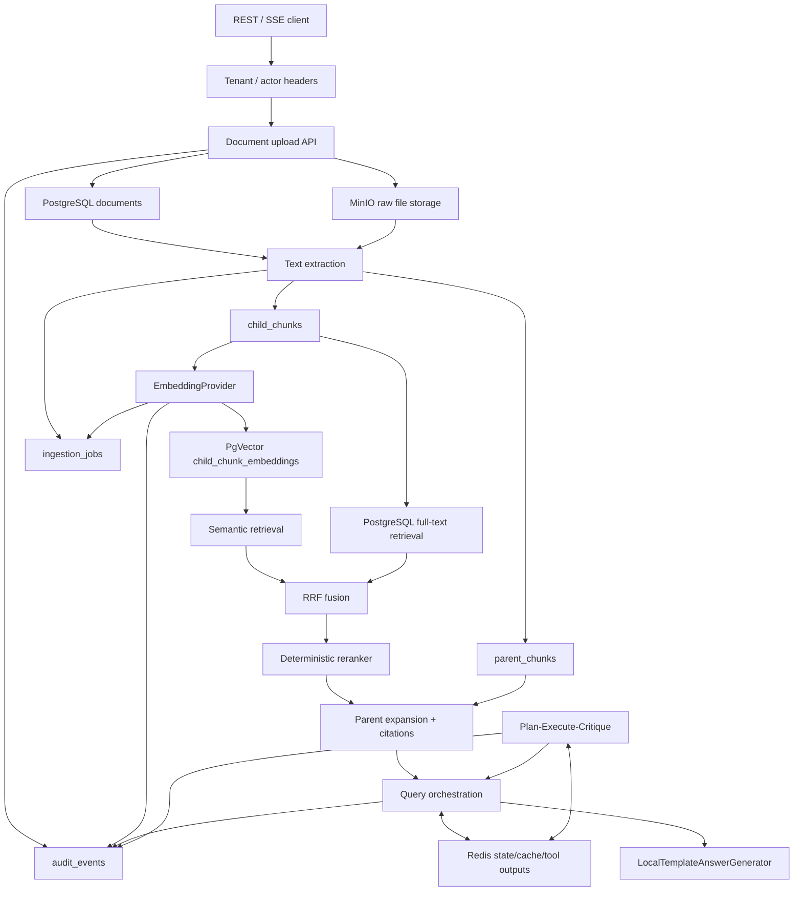

# NexusAgent

NexusAgent is an Enterprise Knowledge Assistant Backend built with Java, Spring WebFlux, PostgreSQL/PgVector, Redis, and MinIO.

Implemented milestones:

- Spring Boot 3.x WebFlux application
- PostgreSQL metadata storage
- Flyway database migration
- MinIO raw file storage
- Redis-backed short-lived session state, retrieval cache, query status, and tool output storage
- REST APIs for health, upload, list, and fetch-by-id
- Text extraction for `text/plain`, `.txt`, Markdown content types, `.md`, and `.markdown`
- Parent-child chunking with PostgreSQL persistence
- APIs to extract/chunk a document and inspect stored chunks
- Deterministic local child-chunk embeddings with PgVector persistence
- APIs to embed child chunks and inspect embedding status
- Hybrid retrieval debug API that combines PgVector semantic search and PostgreSQL full-text search
- Reciprocal Rank Fusion (RRF) over vector and full-text candidate rankings
- Deterministic heuristic reranking for fused retrieval candidates
- Parent context expansion with citation-aware context debug output
- Query API that orchestrates retrieval, reranking, context construction, and local answer generation
- SSE query stream API with stage events
- Stable session, retrieval cache, and tool output interfaces with Redis-backed implementations and local fallback implementations
- Minimal deterministic Plan-Execute-Critique workflow API
- Enterprise-readiness skeleton with tenant/actor headers, tenant-aware filtering, audit events, ingestion job status rows, trace propagation, and safe Actuator health/info

The project still does not implement production LLM answer generation, production-grade enterprise security, or a full autonomous agent platform.

## Why It Is More Than A Chatbot

NexusAgent is a retrieval backend, not a thin chat wrapper. The project models the full data path that an enterprise assistant needs before answer generation can be trusted: raw file storage, metadata persistence, deterministic text extraction, parent-child chunking, child-only embeddings, hybrid retrieval, RRF fusion, reranking, parent context expansion, citation metadata, Redis-backed short-lived state/cache, SSE progress events, and a deterministic Plan-Execute-Critique workflow.

The answer generator is intentionally local and simple. The engineering value is in the backend retrieval and orchestration pipeline, plus clear extension points for real providers later.

## Architecture Diagram



## Documentation Map

- [Architecture](docs/architecture.md)
- [Database schema](docs/schema.md)
- [API reference](docs/api.md)
- [Local demo](docs/demo.md)
- [Enterprise readiness slice](docs/enterprise-readiness.md)
- [Interview defense](docs/interview-defense.md)
- [Limitations and future improvements](docs/limitations.md)
- [Resume claims](docs/resume-claims.md)
- [Troubleshooting](docs/troubleshooting.md)

## Tech Stack

- Java 17
- Spring Boot 3.3.x
- Spring WebFlux
- Project Reactor
- PostgreSQL 16 with PgVector
- R2DBC PostgreSQL
- Flyway
- MinIO
- Redis
- Spring Boot Actuator
- Docker Compose
- JUnit 5
- Testcontainers where Docker is available

## Prerequisites

- Java 17 or newer
- Maven 3.9+
- Docker Desktop or another Docker runtime for local services

The code is compiled with Java release 17 even if a newer JDK is installed locally.

## Local Configuration

Copy the example environment file:

```bash
cp .env.example .env
```

`.env.example` is the committed template that shows safe local defaults. `.env` is your local machine-specific copy and is ignored by git so credentials, port overrides, and local settings are not committed.

Spring Boot imports `.env` during local runs through `spring.config.import`, and Docker Compose also reads the same `.env` file. This keeps the PostgreSQL host, port, database, user, and password aligned between Compose and the application.

Important defaults:

```text
PostgreSQL host: localhost
PostgreSQL host port: 5432
PostgreSQL container port: 5432
PostgreSQL database: nexusagent
PostgreSQL user/password: nexus/nexus-local-password
MinIO API: http://localhost:9000
MinIO console: http://localhost:9001
MinIO user/password: minioadmin/minio-local-password
Bucket: nexus-documents
Redis: localhost:6379
Redis integration enabled: true
Redis recent session TTL: 24 hours
Redis session summary TTL: 7 days
Redis retrieval cache TTL: 30 minutes
Redis tool output TTL: 2 hours
Redis query status TTL: 30 minutes
Redis retrieval cache max value: 128 KiB
Redis tool output max value: 64 KiB
Application upload max: 25 MiB
Multipart disk usage per part: 30 MiB
Multipart in-memory threshold: 1 MiB
Multipart max parts: 4
Parent chunk max chars: 1200
Child chunk max chars: 400
Child chunk overlap chars: 80
Embedding provider: local
Embedding dimension: 384
Retrieval default topK: 10
Retrieval max topK: 50
RRF k: 60
Context default budget: 4000 chars
Context max budget: 12000 chars
Query context timeout: 20s
Query answer timeout: 5s
```

These credentials are local-development placeholders from `.env.example`; replace them in your private `.env` for any non-local environment.

## Enterprise-Readiness Headers

Milestone 10 adds a header-based tenant/actor context:

```text
X-Tenant-Id: tenant-a
X-Actor-Id: actor-1
X-Trace-Id: trace-123
```

If tenant or actor headers are missing, the app uses `tenant_id=default` and `actor_id=anonymous` for local demos. These headers are a skeleton for interview discussion, not production authentication. A real enterprise system would derive tenant and actor from verified identity claims and enforce full authorization policy.

## Start Local Dependencies

```bash
docker compose up -d
```

Check containers:

```bash
docker compose ps
```

PostgreSQL should show as healthy. You can verify it directly:

```bash
docker compose exec postgres pg_isready -U nexus -d nexusagent
```

Redis should respond to ping:

```bash
docker compose exec redis redis-cli ping
```

MinIO console:

```text
http://localhost:9001
```

## Run The App

After PostgreSQL is healthy:

```bash
mvn spring-boot:run
```

The app starts on:

```text
http://localhost:8080
```

Flyway runs automatically at startup and creates the document, chunk, and embedding tables.

Flyway uses:

```text
jdbc:postgresql://${POSTGRES_HOST}:${POSTGRES_PORT}/${POSTGRES_DB}
```

Runtime persistence uses:

```text
r2dbc:postgresql://${POSTGRES_HOST}:${POSTGRES_PORT}/${POSTGRES_DB}
```

Both use the same `POSTGRES_HOST`, `POSTGRES_PORT`, `POSTGRES_DB`, `POSTGRES_USER`, and `POSTGRES_PASSWORD` values.

## API Examples

Health:

```bash
curl http://localhost:8080/api/v1/health
```

Actuator health/info:

```bash
curl http://localhost:8080/actuator/health
curl http://localhost:8080/actuator/info
```

Create a sample document:

```bash
printf "NexusAgent milestone one sample document.\n" > sample.txt
```

Upload it:

```bash
curl -X POST http://localhost:8080/api/v1/documents \
  -H "X-Tenant-Id: tenant-a" \
  -H "X-Actor-Id: actor-1" \
  -F "file=@sample.txt;type=text/plain"
```

Example response shape:

```json
{
  "id": "7bfc50c2-81f9-49df-872f-f401f8fbff20",
  "tenantId": "tenant-a",
  "ownerId": "actor-1",
  "visibility": "TENANT",
  "originalFilename": "sample.txt",
  "contentType": "text/plain",
  "sizeBytes": 44,
  "sha256": "a SHA-256 hex digest",
  "minioBucket": "nexus-documents",
  "minioObjectKey": "documents/7bfc50c2-81f9-49df-872f-f401f8fbff20/sample.txt",
  "status": "STORED",
  "createdAt": "2026-05-07T12:00:00Z",
  "updatedAt": "2026-05-07T12:00:00Z"
}
```

Fetch one document:

```bash
curl http://localhost:8080/api/v1/documents/{document-id}
```

List documents:

```bash
curl "http://localhost:8080/api/v1/documents?limit=50&offset=0"
```

Extract and chunk a supported text document:

```bash
curl -X POST http://localhost:8080/api/v1/documents/{document-id}/chunks
```

By default this endpoint is idempotent. If chunks already exist for the document, it returns the stored chunks without deleting or regenerating them, so chunk IDs and chunk `createdAt` values stay stable.

Force regeneration only when you intentionally want to replace the existing chunks:

```bash
curl -X POST "http://localhost:8080/api/v1/documents/{document-id}/chunks?force=true"
```

Inspect stored chunks:

```bash
curl http://localhost:8080/api/v1/documents/{document-id}/chunks
```

Inspect ingestion jobs:

```bash
curl http://localhost:8080/api/v1/documents/{document-id}/ingestion-jobs \
  -H "X-Tenant-Id: tenant-a" \
  -H "X-Actor-Id: actor-1"
```

Example chunk response shape:

```json
{
  "documentId": "7bfc50c2-81f9-49df-872f-f401f8fbff20",
  "parentChunkCount": 1,
  "childChunkCount": 2,
  "parentChunks": [
    {
      "id": "parent uuid",
      "chunkIndex": 0,
      "text": "larger context block",
      "charStart": 0,
      "charEnd": 1200,
      "tokenCount": 180,
      "createdAt": "2026-05-10T12:00:00Z"
    }
  ],
  "childChunks": [
    {
      "id": "child uuid",
      "parentChunkId": "parent uuid",
      "chunkIndex": 0,
      "text": "smaller retrieval-focused window",
      "charStart": 0,
      "charEnd": 400,
      "tokenCount": 60,
      "createdAt": "2026-05-10T12:00:00Z"
    }
  ]
}
```

Generate embeddings for child chunks:

```bash
curl -X POST http://localhost:8080/api/v1/documents/{document-id}/embed
```

Check embedding status:

```bash
curl http://localhost:8080/api/v1/documents/{document-id}/embedding-status
```

Example embedding status response:

```json
{
  "documentId": "7bfc50c2-81f9-49df-872f-f401f8fbff20",
  "childChunkCount": 2,
  "embeddedChildChunkCount": 2,
  "missingChildChunkCount": 0,
  "complete": true,
  "provider": "local",
  "modelName": "local-deterministic-hash-384",
  "dimension": 384
}
```

Run hybrid retrieval debug after a document has been uploaded, chunked, and embedded:

```bash
curl -X POST http://localhost:8080/api/v1/retrieval/debug \
  -H "Content-Type: application/json" \
  -d '{
    "query": "security policy",
    "documentIds": ["{document-id}"],
    "topK": 5
  }'
```

Example retrieval debug response shape:

```json
{
  "query": "security policy",
  "vectorCandidates": [
    {
      "childChunkId": "child uuid",
      "parentChunkId": "parent uuid",
      "documentId": "document uuid",
      "chunkIndex": 0,
      "previewText": "security policy access controls",
      "source": "vector",
      "vectorRank": 1,
      "vectorDistance": 0.12,
      "fullTextRank": null,
      "fullTextScore": null,
      "rrfScore": null
    }
  ],
  "fullTextCandidates": [
    {
      "childChunkId": "child uuid",
      "parentChunkId": "parent uuid",
      "documentId": "document uuid",
      "chunkIndex": 0,
      "previewText": "security policy access controls",
      "source": "full_text",
      "vectorRank": null,
      "vectorDistance": null,
      "fullTextRank": 1,
      "fullTextScore": 0.83,
      "rrfScore": null
    }
  ],
  "fusedCandidates": [
    {
      "childChunkId": "child uuid",
      "parentChunkId": "parent uuid",
      "documentId": "document uuid",
      "chunkIndex": 0,
      "previewText": "security policy access controls",
      "source": "both",
      "vectorRank": 1,
      "vectorDistance": 0.12,
      "fullTextRank": 1,
      "fullTextScore": 0.83,
      "rrfScore": 0.03278688524590164
    }
  ]
}
```

Build citation-aware debug context after a document has been uploaded, chunked, and embedded:

```bash
curl -X POST http://localhost:8080/api/v1/context/debug \
  -H "Content-Type: application/json" \
  -d '{
    "query": "security policy",
    "documentIds": ["{document-id}"],
    "topK": 5,
    "contextBudgetChars": 2000
  }'
```

Example context debug response shape:

```json
{
  "query": "security policy",
  "rerankedCandidates": [
    {
      "childChunkId": "child uuid",
      "parentChunkId": "parent uuid",
      "documentId": "document uuid",
      "source": "both",
      "rrfScore": 0.03278688524590164,
      "rerankedRank": 1,
      "rerankScore": 3.87,
      "reason": "rank=1 rrf=3.2787 keyword=0.4000 source=0.2000 diversityPenalty=0.0000"
    }
  ],
  "selectedChildChunks": [
    {
      "childChunkId": "child uuid",
      "parentChunkId": "parent uuid",
      "documentId": "document uuid",
      "originalFilename": "sample.txt",
      "chunkIndex": 0,
      "charStart": 0,
      "charEnd": 120,
      "selectionReason": "Selected for citation [C1]"
    }
  ],
  "expandedParentContexts": [
    {
      "parentChunkId": "parent uuid",
      "documentId": "document uuid",
      "originalFilename": "sample.txt",
      "text": "larger parent context text",
      "truncated": false,
      "includedChars": 26
    }
  ],
  "citations": [
    {
      "citationMarker": "[C1]",
      "documentId": "document uuid",
      "originalFilename": "sample.txt",
      "parentChunkId": "parent uuid",
      "childChunkId": "child uuid",
      "chunkIndex": 0,
      "charStart": 0,
      "charEnd": 120,
      "previewText": "security policy access controls"
    }
  ],
  "finalContextText": "[C1] sample.txt parent_chunk=parent uuid\nlarger parent context text",
  "debugMetadata": {
    "reranker": "deterministic-heuristic",
    "appliedBudgetChars": 2000,
    "usedBudgetChars": 26
  }
}
```

Ask a query after a document has been uploaded, chunked, and embedded:

```bash
curl -X POST http://localhost:8080/api/v1/query \
  -H "Content-Type: application/json" \
  -d '{
    "sessionId": "local-demo-session",
    "question": "What does the security policy say?",
    "documentIds": ["{document-id}"],
    "topK": 5,
    "contextBudgetChars": 2000,
    "debug": false
  }'
```

Example query response shape:

```json
{
  "traceId": "query trace id",
  "answer": "LocalTemplateAnswerGenerator placeholder answer: Based on the retrieved context...",
  "citations": [
    {
      "citationMarker": "[C1]",
      "documentId": "document uuid",
      "originalFilename": "sample.txt",
      "parentChunkId": "parent uuid",
      "childChunkId": "child uuid",
      "chunkIndex": 0,
      "charStart": 0,
      "charEnd": 120,
      "previewText": "security policy access controls"
    }
  ]
}
```

Set `debug=true` to include `finalContextText`, `retrievalDebug`, `contextDebug`, local generator limitations, and `retrievalCacheStatus`:

```bash
curl -X POST http://localhost:8080/api/v1/query \
  -H "Content-Type: application/json" \
  -d '{
    "sessionId": "local-demo-session",
    "question": "What does the security policy say?",
    "documentIds": ["{document-id}"],
    "topK": 5,
    "contextBudgetChars": 2000,
    "debug": true
  }'
```

`retrievalCacheStatus` is `miss` for a context build that ran retrieval/context construction and `hit` when an equivalent request reused Redis-cached context. This field is debug-only and is omitted from the default public response.

Stream query progress with SSE:

```bash
curl -N -X POST http://localhost:8080/api/v1/query/stream \
  -H "Content-Type: application/json" \
  -H "Accept: text/event-stream" \
  -d '{
    "sessionId": "local-demo-session",
    "question": "What does the security policy say?",
    "documentIds": ["{document-id}"],
    "topK": 5,
    "contextBudgetChars": 2000,
    "debug": false
  }'
```

The stream emits events such as `received`, `retrieving`, `reranking`, `building_context`, `generating`, `message`, `completed`, and `error`.

This endpoint uses `POST` because the query request contains a JSON body. It works with clients such as `curl`, `fetch`, and server-side HTTP clients that can read `text/event-stream` responses. Browser `EventSource` normally uses `GET`, so an EventSource-specific client would need a separate GET-based endpoint or a small adapter.

Milestone 6 uses `LocalTemplateAnswerGenerator`, which is an honest local placeholder. It builds a simple response from retrieved context and citations, and it does not call an external model.

Run the minimal Plan-Execute-Critique workflow on top of the query pipeline:

```bash
curl -X POST http://localhost:8080/api/v1/agent/query \
  -H "Content-Type: application/json" \
  -d '{
    "sessionId": "local-demo-session",
    "question": "What does the security policy say?",
    "documentIds": ["{document-id}"],
    "topK": 5,
    "contextBudgetChars": 2000,
    "debug": false
  }'
```

Example public agent response shape:

```json
{
  "traceId": "query trace id",
  "answer": "LocalTemplateAnswerGenerator placeholder answer: Based on retrieved evidence...",
  "citations": [
    {
      "citationMarker": "[C1]",
      "documentId": "document uuid",
      "originalFilename": "sample.txt",
      "parentChunkId": "parent uuid",
      "childChunkId": "child uuid",
      "chunkIndex": 0,
      "charStart": 0,
      "charEnd": 120,
      "previewText": "security policy access controls"
    }
  ],
  "workflowStatus": "COMPLETED"
}
```

Set `debug=true` to include deterministic workflow internals:

```json
{
  "traceId": "query trace id",
  "answer": "answer text",
  "citations": [],
  "workflowStatus": "COMPLETED_WITH_FALLBACK",
  "plan": {
    "plannerName": "deterministic-rule-planner",
    "rationale": "The request should be answered from retrieved document context.",
    "steps": [
      {
        "stepIndex": 1,
        "action": "RETRIEVE_CONTEXT",
        "description": "Call the existing query pipeline to retrieve context and citations."
      }
    ]
  },
  "executionResult": {
    "traceId": "query trace id",
    "executedActions": ["RETRIEVE_CONTEXT", "GENERATE_ANSWER"],
    "retrievalUsed": true,
    "fallbackUsed": false,
    "answerSource": "query-orchestration-service",
    "retrievalCacheStatus": "miss",
    "citationCount": 1,
    "notes": ["Executed the existing query pipeline for retrieval, context construction, and local answer generation."]
  },
  "critiqueResult": {
    "outcome": "PASS",
    "grounded": true,
    "findings": ["The answer includes retrieved citations and passed deterministic grounding checks."]
  }
}
```

This workflow is intentionally small. It is a rule-based planner, an executor that reuses the existing query pipeline, and a deterministic critique step. It is not a multi-agent system and does not call an external model.

## Demo Scripts

The repository includes `examples/security-handbook.md`, `scripts/demo.sh`, and Makefile targets for an end-to-end local demo.

Start dependencies:

```bash
make start-stack
```

Start the app in another terminal:

```bash
make run
```

Run the demo after the app is healthy:

```bash
make demo
```

Individual demo steps are also available:

```bash
make upload
make chunk
make embed
make retrieval-debug
make context-debug
make query
make query-sse
make agent-query
make redis-keys
```

See [docs/demo.md](docs/demo.md) for expected output and troubleshooting tips.

## Run Tests

```bash
mvn test
```

The test suite includes:

- Application context startup test
- Document upload service unit tests
- Text extraction unit tests
- Parent-child chunking unit tests
- Chunking idempotency and force-regeneration unit tests
- Document chunking status update unit tests
- Empty extracted text validation test
- Deterministic embedding provider unit tests
- Child chunk embedding service unit tests
- Embedding API route tests
- Semantic retrieval service unit tests
- Full-text retrieval service unit tests
- RRF formula, deduplication, and source-tracking unit tests
- Hybrid retrieval orchestration unit tests
- Retrieval debug API route tests
- Deterministic heuristic reranker unit tests
- Parent context expansion unit tests
- Context budget trimming and parent deduplication tests
- Citation formatting tests
- Context debug API route tests
- Local template answer generator tests
- Query orchestration, timeout fallback, and debug-field visibility tests
- Query REST validation and SSE route tests
- SSE event ordering, error event, and trace ID consistency tests
- Placeholder state/cache/tool-output service tests
- Redis key format tests
- Redis JSON serialization and schema-version tests
- Redis retrieval cache hit/miss and unavailable-fallback tests
- Query debug cache hit/miss visibility tests
- Redis session state write/read tests
- Redis tool output write/read and size-limit tests
- Agent workflow planning, execution, critique, debug visibility, and route tests
- Request context header/default validation tests
- Tenant-aware document access and retrieval context tests
- Audit event write tests
- Ingestion job status transition tests
- Trace header propagation tests
- PostgreSQL metadata persistence integration test
- Parent-child chunk persistence integration test
- PgVector embedding persistence and vector search integration tests
- PostgreSQL full-text and vector retrieval integration tests

The persistence integration tests use Testcontainers with the `pgvector/pgvector:pg16` image. If Docker is not available to Testcontainers, those tests are skipped.

## Troubleshooting Local PostgreSQL

### Port 5432 Is Already Allocated

If another local PostgreSQL is already using port `5432`, change `POSTGRES_PORT` in `.env`:

```text
POSTGRES_HOST=localhost
POSTGRES_PORT=55432
POSTGRES_DB=nexusagent
POSTGRES_USER=nexus
POSTGRES_PASSWORD=nexus-local-password
```

Then recreate the Compose service:

```bash
docker compose down
docker compose up -d postgres
docker compose ps postgres
mvn spring-boot:run
```

Because Spring Boot imports `.env`, Flyway and R2DBC will use the same new host port that Docker Compose exposes.

### PostgreSQL Container Is Not Healthy

Check status:

```bash
docker compose ps postgres
```

Check logs:

```bash
docker compose logs postgres
```

Run the readiness probe manually:

```bash
docker compose exec postgres pg_isready -U nexus -d nexusagent
```

If the container is unhealthy because credentials or database names changed, reset the local volume:

```bash
docker compose down -v
docker compose up -d postgres
```

This deletes local PostgreSQL data. Use it only for local development.

### Flyway Connection Refused

`Connection to localhost:5432 refused` means the app cannot reach PostgreSQL on the configured host/port.

Check the effective Compose port:

```bash
docker compose config | grep -A5 "target: 5432"
```

Check that PostgreSQL is running and healthy:

```bash
docker compose ps postgres
docker compose exec postgres pg_isready -U nexus -d nexusagent
```

Then confirm `.env` matches the app configuration:

```bash
grep '^POSTGRES_' .env
```

The default working local values are:

```text
POSTGRES_HOST=localhost
POSTGRES_PORT=5432
POSTGRES_DB=nexusagent
POSTGRES_USER=nexus
POSTGRES_PASSWORD=nexus-local-password
```

## Milestone 1 Design

Upload flow:

```text
Client multipart upload
  -> WebFlux controller
  -> temporary local upload file
  -> file inspection: size + SHA-256
  -> MinIO raw object storage
  -> PostgreSQL document metadata row
  -> API response
```

MinIO stores the raw file. PostgreSQL stores source-of-truth metadata, chunks, and child chunk embeddings. Redis is used by later query/workflow stages for short-lived state/cache only, never as durable document storage.

Flyway uses the JDBC PostgreSQL driver because Flyway is a blocking schema migration tool. Runtime metadata persistence uses R2DBC through Spring's reactive `DatabaseClient`.

The local PostgreSQL image is `pgvector/pgvector:pg16`, which includes PgVector support. The migration uses `CREATE EXTENSION IF NOT EXISTS vector`, so re-running migrations against an existing database is safe for that extension statement.

## Upload Limits

There are two layers of upload limits:

- Spring WebFlux multipart limits control request parsing and temporary multipart storage.
- `nexus.upload.max-file-size-bytes` is the application-level validation after the file is received and inspected.

Defaults:

```text
spring.webflux.multipart.max-in-memory-size=1MB
spring.webflux.multipart.max-disk-usage-per-part=30MB
spring.webflux.multipart.max-parts=4
nexus.upload.max-file-size-bytes=26214400
```

The multipart disk limit is slightly larger than the application file limit so the app can return its own validation error for oversized files near the boundary.

## Blocking Client Trade-Off

The MinIO Java client and local file hashing are blocking operations. The project isolates them behind service boundaries and runs them on Reactor `boundedElastic`:

- `MinioObjectStorageService`
- `UploadedFileInspector`
- temporary file creation/deletion inside `DocumentUploadService`
- MinIO reads used by text extraction

This keeps the WebFlux request flow from doing blocking file/object-storage work on event-loop threads. The trade-off is that uploads are buffered to a temporary local file before object storage, and extraction reads the raw object bytes through the MinIO client.

Temporary file cleanup is handled with Reactor `usingWhen`, which is the reactive equivalent of a composed finally block. It runs cleanup on completion, error, and cancellation.

If MinIO object storage succeeds but PostgreSQL metadata persistence fails, the upload service now attempts best-effort deletion of the just-created MinIO object. If that cleanup fails, the original metadata persistence error is preserved and the cleanup failure is logged.

Flyway uses JDBC at startup because Flyway is a blocking migration tool. Request-time document metadata reads and writes use R2DBC through Spring's reactive `DatabaseClient`.

## Milestone 2 Design

Milestone 2 adds extraction and chunking for text and Markdown documents.

Chunking flow:

```text
POST /api/v1/documents/{id}/chunks
  -> look up document metadata in PostgreSQL
  -> if chunks already exist and force=false, return stored chunks unchanged
  -> otherwise read raw object from MinIO
  -> extract UTF-8 text for supported text/Markdown files
  -> split parent chunks as larger context blocks
  -> split child chunks as smaller overlapping windows inside each parent
  -> transactionally replace stored chunks in PostgreSQL
```

Parent chunks are larger blocks used later for context expansion. Child chunks are smaller sliding-window chunks intended for precise retrieval in Milestone 3 and Milestone 4. Milestone 2 stores the parent-child structure only; it does not embed chunks or search them.

Stable chunk IDs matter because later embeddings, retrieval results, citations, and retrieval-cache entries will point at `child_chunk_id` and `parent_chunk_id`. For that reason, `POST /api/v1/documents/{id}/chunks` is idempotent by default. Passing `force=true` explicitly deletes and regenerates chunks, which may create new IDs.

Supported extraction inputs:

- `text/plain`
- `text/markdown`
- `text/x-markdown`
- `application/markdown`
- `.txt`
- `.md`
- `.markdown`

Unsupported formats such as PDF and Word return a clear validation error for now.

## Milestone 3 Design

Milestone 3 adds child-chunk embeddings and PgVector storage.

Embedding flow:

```text
POST /api/v1/documents/{id}/embed
  -> look up document metadata in PostgreSQL
  -> load parent/child chunks from PostgreSQL
  -> reject documents that have not been chunked
  -> skip child chunks that already have embeddings
  -> embed only missing child chunks
  -> store vectors in child_chunk_embeddings
  -> return embedding status
```

Only child chunks are embedded. Parent chunks stay as context-expansion records and are not embedded in this MVP.

The default provider is `LocalDeterministicEmbeddingProvider`, which produces deterministic 384-dimensional hash-based vectors for local demos and tests. It is not a semantic production model. A `SpringAiEmbeddingProvider` boundary exists, but no Spring AI client is enabled by default and no external API key is required.

`child_chunk_embeddings` stores one row per embedded child chunk, keyed by `child_chunk_id`. If a document is force re-chunked, old child rows are deleted and their embeddings are removed through foreign-key cascade. PgVector exact similarity search is used by Milestone 4 semantic retrieval. The migration attempts to create an HNSW cosine index only when the local PgVector build exposes the `hnsw` access method; exact scan remains the fallback.

## Milestone 4 Design

Milestone 4 adds hybrid retrieval and RRF.

Retrieval flow:

```text
POST /api/v1/retrieval/debug
  -> validate query and topK
  -> SemanticRetrievalService embeds the query and runs PgVector search over child_chunk_embeddings
  -> FullTextRetrievalService runs PostgreSQL full-text search over child_chunks.text
  -> RrfFusionService deduplicates by child_chunk_id and fuses rank positions
  -> API returns vector candidates, full-text candidates, and fused candidates with debug fields
```

Semantic retrieval and full-text retrieval produce separate ranked lists. The implementation does not compare raw vector distance to raw full-text score because those numbers have different meanings. RRF uses only each candidate's rank position:

```text
score = sum(1 / (k + rank_i))
```

The default `k` is 60. Candidates that appear in both lists usually receive a stronger fused score because they contribute rank evidence from both retrieval paths.

`child_chunk_id` is the deduplication key. `parent_chunk_id`, `document_id`, `chunk_index`, and preview text are preserved so the next milestone can expand precise child hits into parent context and citations.

## Milestone 5 Design

Milestone 5 adds reranking and context construction for later answer construction.

Context flow:

```text
POST /api/v1/context/debug
  -> HybridRetrievalService gets fused child chunk candidates
  -> Reranker reranks fused candidates
  -> ParentContextExpansionService loads full child chunks, parent chunks, and document metadata
  -> ContextBuilder selects top child hits, deduplicates parent chunks, and applies a character budget
  -> CitationFormatter creates citation markers and final context text
  -> API returns reranked candidates, selected child chunks, parent contexts, citations, and debug metadata
```

The default reranker is `DeterministicHeuristicReranker`. It is not a cross-encoder and does not call an external rerank API. It combines RRF score, keyword overlap against candidate preview text, source signal, and simple parent/document diversity penalties. The interface is intentionally small so a real reranker can replace it later.

Child chunks remain the retrieval units. Parent chunks are the context units. The context builder expands selected child chunks through `parent_chunk_id`, deduplicates repeated parent chunks, and trims parent text to `contextBudgetChars`. The budget is character-based in the MVP, not model-token-based. When a parent context is too large, trimming is centered around the selected child chunk offsets so the cited evidence remains visible.

## Milestone 6 Design

Milestone 6 adds the user-facing query API and SSE response flow.

Query flow:

```text
POST /api/v1/query
  -> QueryOrchestrationService validates the question and creates a traceId
  -> ContextBuilder runs hybrid retrieval, reranking, parent expansion, and citation formatting
  -> LocalTemplateAnswerGenerator builds a simple grounded response from finalContextText and citations
  -> QueryResponse returns answer, citations, traceId, and optional debug fields
```

SSE flow:

```text
POST /api/v1/query/stream
  -> received
  -> retrieving
  -> reranking
  -> building_context
  -> generating
  -> message
  -> completed
```

`SessionStateService`, `RetrievalCacheService`, and `ToolOutputStore` are defined in this milestone so the orchestration code already has the right boundaries. The current implementations are intentionally simple:

- `InMemorySessionStateService` records session events in local process memory.
- `NoOpRetrievalCacheService` never returns cached context and does not persist cache entries.
- `NoOpToolOutputStore` accepts writes but does not persist them.

Redis-backed implementations are intentionally deferred to Milestone 7. The query API does not claim durable session state, shared cache behavior, or persistent intermediate outputs yet.

The query orchestration applies a context-building timeout and an answer-generation timeout. Context timeout returns an empty local fallback context, and answer timeout returns a local timeout message. This keeps the API predictable for local demos without hiding the fact that production behavior would need stronger retry, observability, and persistence policies.

If context construction returns no context or times out, the local generator returns an explicit insufficient-context answer. It does not fabricate grounded claims and does not create fake citations.

Blank `question`, `topK < 1`, and `contextBudgetChars < 1` return clear bad-request responses.

## Milestone 7 Design

Milestone 7 replaces the Milestone 6 placeholder runtime behavior with Redis-backed short-lived state and cache implementations while keeping the same interfaces.

Redis-backed services:

- `RedisSessionStateService`
- `RedisRetrievalCacheService`
- `RedisToolOutputStore`

Fallback services remain available when `NEXUS_REDIS_ENABLED=false`:

- `InMemorySessionStateService`
- `NoOpRetrievalCacheService`
- `NoOpToolOutputStore`

Redis key patterns:

```text
session:{sessionId}:recent
session:{sessionId}:summary
retrieval:{queryHash}:candidates
tool:{sessionId}:{toolCallId}:result
query:{traceId}:status
```

For tool outputs, the query orchestration uses `sessionId` when the request provides one and falls back to `traceId` when there is no session ID.

Redis stores JSON envelopes with `schemaVersion` fields. Retrieval cache keys include the normalized query hash, sorted `documentIds`, effective `topK`, effective `contextBudgetChars`, and retrieval/context settings that affect output. This avoids reusing cached context across materially different retrieval settings.

TTL defaults are intentionally different:

- Recent session events: 24 hours, because they are useful for short local continuity.
- Session summaries: 7 days, because summaries can outlive individual recent events.
- Retrieval cache: 30 minutes, because retrieved context can go stale after document reprocessing.
- Tool outputs: 2 hours, because intermediate outputs are temporary.
- Query status: 30 minutes, because status is only useful for recent traces.

Redis failures are non-fatal for query execution. Cache reads degrade to misses, and failed cache/state/tool writes are logged and treated as no-op writes. PostgreSQL and MinIO remain the source of truth.

Redis value sizes are bounded. Retrieval cache entries above `NEXUS_REDIS_MAX_CACHE_ENTRY_BYTES` and tool outputs above `NEXUS_REDIS_MAX_TOOL_OUTPUT_BYTES` are skipped instead of being stored. The application does not store raw uploaded documents in Redis.

Every Redis write uses a positive TTL. Recent session events use list trim plus key expiration, and value-style keys use Redis `SET` with expiration. Redis TTL and size-limit settings reject non-positive values during configuration binding.

## Milestone 8 Design

Milestone 8 adds a minimal Plan-Execute-Critique workflow on top of the query pipeline.

Workflow:

```text
POST /api/v1/agent/query
  -> AgentOrchestrator
  -> plan with deterministic rules
  -> execute selected action
       -> fallback response, direct local response, or existing QueryOrchestrationService
  -> critique answer/citation consistency
  -> store plan, execution, and critique outputs through ToolOutputStore
  -> return public answer/citations/status plus optional debug internals
```

The planner has three actions:

- `RETRIEVE_CONTEXT`: use the existing retrieval/context/query path.
- `GENERATE_ANSWER`: return a direct deterministic local response for simple conversational requests.
- `FALLBACK_INSUFFICIENT_CONTEXT`: return an explicit fallback for low-information requests.

The critique step is deterministic. It checks whether retrieval was used, whether the answer reports insufficient context, whether citations exist, and whether the answer references a citation marker that actually exists in the returned citation list. It does not use an LLM-as-judge.

When Redis is enabled, workflow outputs are stored through the same `ToolOutputStore` interface with TTL and size limits. The workflow stores plan/execution/critique summaries, not raw uploaded documents or unbounded parent context blobs. Redis still is not the source of truth.

## Milestone 10 Design

Milestone 10 adds a small enterprise-readiness slice.

Request context:

```text
X-Tenant-Id -> tenant_id
X-Actor-Id -> actor_id / owner_id
X-Trace-Id -> query and agent trace propagation
```

Missing tenant and actor headers fall back to `default` and `anonymous` for local demos. This is not production authentication.

The `documents` table now includes `tenant_id`, `owner_id`, and `visibility`. Document list/get, chunking, embedding, retrieval, context construction, query, and agent flows use tenant-aware filters. Retrieval repositories join back to `documents`, so vector and full-text candidates are scoped by tenant before they are returned.

Redis retrieval cache keys include tenant and actor scope in the hashed key input. The same query from two tenants will not reuse the same cached context, and private-scope access is separated by actor.

Milestone 10 also adds:

- `audit_events` for upload, chunk, force re-chunk, embed, query, and agent query events.
- `ingestion_jobs` for synchronous chunk/embed job status rows.
- Safe Actuator `health` and `info` endpoints.
- Structured logs for lifecycle events and candidate counts.

The audit metadata intentionally avoids raw document text, full context, embeddings, and unbounded user-controlled values. Query audit metadata uses hashes and small counts. Ingestion jobs are status records for the current synchronous APIs, not a background queue.

## Interview Defense Summary

The strongest way to present NexusAgent is as an enterprise retrieval backend with honest AI boundaries:

- Storage is separated by responsibility: MinIO for raw bytes, PostgreSQL for source-of-truth metadata/chunks/embeddings, and Redis for short-lived cache/state.
- Parent-child chunking separates precise retrieval from readable context.
- Child chunks are embedded; parent chunks are used for context expansion.
- Hybrid retrieval combines semantic vector search with full-text search, then uses RRF because raw scores are not comparable.
- Reranking and context construction are deterministic and testable in this MVP.
- Query and SSE APIs expose the pipeline without claiming production answer quality.
- Plan-Execute-Critique is a small deterministic workflow, not a fake autonomous platform.
- Milestone 10 adds enterprise-aware skeletons without claiming production-grade security.

Use [docs/interview-defense.md](docs/interview-defense.md) for a 60-second pitch and deeper Q&A.

## Safe Resume Wording

```text
Built NexusAgent, a Java/Spring WebFlux backend for enterprise-aware document retrieval and citation-aware question answering workflows, using PostgreSQL/PgVector, Redis, MinIO, Flyway, and Docker Compose.
```

```text
Implemented parent-child RAG ingestion with MinIO raw-file storage, PostgreSQL metadata, child-only PgVector embeddings, hybrid retrieval with RRF, heuristic reranking, citation-aware context construction, and Redis-backed short-lived state/cache.
```

```text
Added an enterprise-readiness slice with tenant-aware request context, repository-level tenant filtering, tenant-scoped Redis cache keys, audit events, ingestion job tracking, and trace-friendly observability.
```

Avoid claims about production readiness, production-grade enterprise security, live LLM answer quality, real cross-encoder reranking, autonomous multi-agent behavior, or production performance benchmarks.

## Known Limitations

- Text extraction only supports UTF-8 plain text and Markdown-like files.
- Tenant and actor context is header-based for the MVP; it is not production authentication.
- There is no full RBAC/ABAC or production tenant isolation guarantee yet.
- Audit events avoid raw text/context but are not a compliance-grade audit subsystem.
- Ingestion jobs are synchronous status rows, not async workers.
- PDF and Word extraction are not implemented yet.
- The local deterministic embedding provider is useful for tests and demos, but it is not a real semantic embedding model.
- Query responses use `LocalTemplateAnswerGenerator`, a local placeholder generator. It is not a production LLM answer service.
- The Plan-Execute-Critique workflow is deterministic and rule-based; it is not a full autonomous agent platform.
- The critique step checks citation presence and markers, not factual correctness with a learned judge.
- The workflow is not production agent infrastructure; it has no durable workflow audit table, autonomous worker model, or complex tool graph.
- The default reranker is heuristic and deterministic, not a trained cross-encoder.
- Context budgeting is character-based, not model-token-based.
- SSE emits stage events and a final message, but it does not stream tokens from a production LLM.
- PostgreSQL full-text search uses the English text search configuration for now.
- RRF fuses rank positions only; it does not calibrate vector distances against full-text scores.
- Redis stores short-lived state/cache only, not source-of-truth data.
- Retrieval cache invalidation after `force=true` re-chunking is TTL-based for now; there is no active cache eviction hook yet.
- Redis failures are logged and degraded to no-op/cache-miss behavior, but there are no Redis health metrics yet.
- Uploads are written to a temporary local file before MinIO storage.
- `force=true` replacement deletes and recreates chunks for a document, but there is no chunk-version history or audit trail yet.
- Re-chunking invalidates old embeddings through cascade delete, but there is no explicit embedding job history or invalidation event yet.
- Token counts are approximate whitespace counts, not model-token counts.
- Embedding dimension is fixed at 384 for the current schema; changing dimensions requires a migration.
- If MinIO upload succeeds but PostgreSQL persistence fails, Milestone 1 attempts best-effort MinIO cleanup. An orphaned object can still remain if cleanup also fails.
- There is no production authentication, production tenant isolation guarantee, malware scanning, file type policy, or production observability yet.
- Docker images are intended for local development, not production deployment.

## Future Improvements

- Add an outbox/reconciliation flow for partial upload failures that remain after best-effort cleanup.
- Add document status transitions for extraction and ingestion.
- Add PDF and Word extractors behind the `DocumentTextExtractor` interface.
- Add model-aware token counting.
- Add a real Spring AI `EmbeddingModel` adapter implementation.
- Add a real reranker implementation behind the `Reranker` interface.
- Replace placeholder query answer generation with a real answer service behind `AnswerGenerator`.
- Add richer planning policies only after the single-query workflow is well tested.
- Add stronger answer-grounding evaluation if a real answer service is introduced.
- Add explicit Redis cache invalidation after forced re-chunking or re-embedding.
- Add Redis health metrics and cache hit/miss counters.
- Add token-aware streaming if a real streaming answer provider is introduced.
- Add language-aware full-text configuration and query preprocessing.
- Add authentication and tenant-aware access control in a later hardening milestone.
