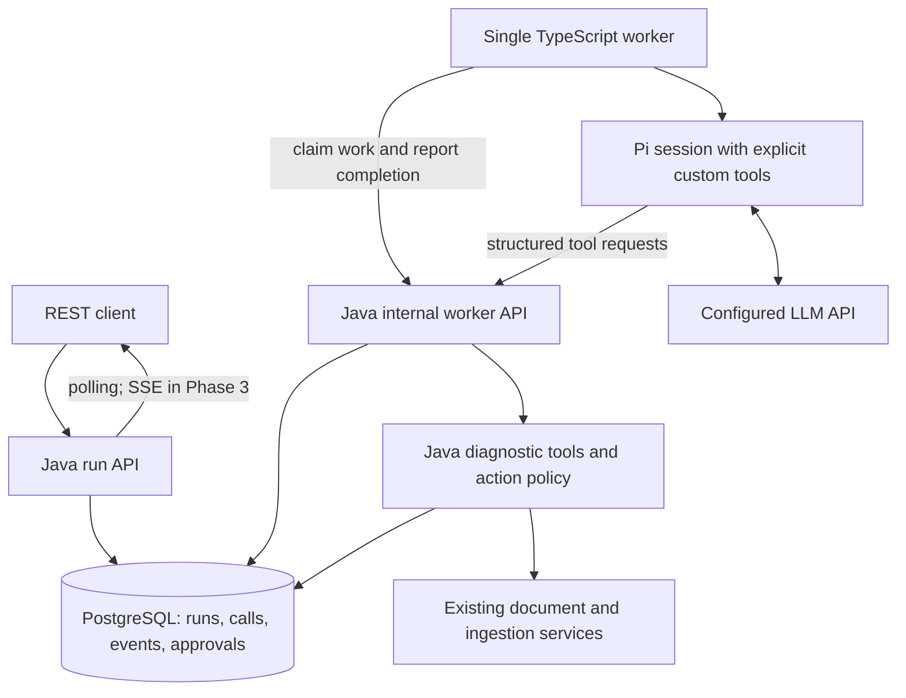

# NexusAgent Agent Harness Integration Design

Date: 2026-09-10

Status: Approved. Phases 1/2 were reviewed; Phase 3 is implemented for review. See [Chinese Phase 3 review](../../review/agent-harness-phase-3.md). The live OpenAI `gpt-5.6-luna` smoke test covered read-only Phase 1, not Phase 2/3 model-driven acceptance; see [evidence and limits](../../verification/agent-harness-gpt-5.6-luna.md). The original design below records the phased target; consult [the implementation guide](../../agent-harness.md) for the delivered API and limitations.

## 1. Review Summary

Build a document-processing diagnostics assistant on top of the existing Java backend. A Pi worker will inspect selected documents through controlled tools, explain the available evidence, and eventually propose approved retries. Existing RAG behavior remains the baseline; improving retrieval quality is outside this extension.

The implementation owner builds the code, tests, documentation, and learning notes. The project owner reviews each small delivery before the next phase.

| Decision | Proposed boundary |
| --- | --- |
| First use case | Diagnose processing problems for explicitly selected documents |
| Runtime | One TypeScript/Pi worker, one active run at a time |
| Java ownership | Run state, document access checks, tool execution, approval, persistence, and events |
| Pi ownership | Model interaction, tool selection, bounded conversation, and report drafting |
| First delivery | Read-only diagnostics with persistent runs and tool results |
| Later deliveries | Approved retries, followed by recovery and replayable SSE events |
| New external dependency | One tool-capable LLM provider, configured in local `.env` later |
| Model-free testing | Explicit `scripted` worker mode; never label it as real model execution |
| Durable storage | PostgreSQL, including reports and bounded tool observations |
| Redis | Optional short-lived data only; not required for run correctness |
| Deferred | Force rechunking, new retrieval models, reranker services, multiple harnesses, general shell access, and frontend work |

Review sections 4-6 for the user experience and trust boundaries, sections 7-10 for the engineering contracts, and section 13 for the first delivery's Definition of Done.

Approval of this design establishes the direction. Implementation still proceeds one phase at a time, with phase-specific review and explicit implementation status.

## 2. Current Code and Reuse Boundaries

These are current implementation facts, verified before writing this proposal:

| Existing component | What can be reused | What is still missing |
| --- | --- | --- |
| `agent/application/AgentOrchestrator` | Existing deterministic query workflow as a separate demo | It has no model-driven tool loop or durable run recovery |
| `documents/repository/DocumentRepository` | Tenant and PRIVATE-owner filtering | Header identity is not verified authentication |
| `enterprise/ingestion/IngestionJobService` | Synchronous CHUNK/EMBED execution records | It creates RUNNING rows directly; it is not a queue or worker |
| `enterprise/ingestion/IngestionJob` | Job type, status, timestamps, and error text | No structured error category or reliable retry classification |
| `chunking/application/DocumentChunkingService` | Ordinary chunking returns existing chunks when available | Default idempotence does not serialize concurrent callers |
| `embeddings/application/ChildChunkEmbeddingService` | Missing-child embedding completion and status inspection | Partial progress is allowed; existing embedding IDs are not a general model-version migration mechanism |
| `query/application/ToolOutputStore` | Best-effort temporary diagnostic copies if needed | Redis TTL output cannot serve as a durable checkpoint |
| `query/application/QueryOrchestrationService` | Reactor composition and SSE conventions | Existing progress events are not a persisted, replayable run log |
| `enterprise/audit/AuditService` | Bounded audit metadata and correlation | Fail-open audit writes cannot authorize or record the only copy of an approval |

Java paths in this table are relative to `src/main/java/com/nexusagent/`.

The new flow uses `/api/v1/agent/runs`. The current `/api/v1/agent/query`, query/SSE, upload, chunk, embed, and retrieval APIs keep their existing contracts. Run diagnostics use narrow metadata projections rather than sending the output of the chunk inspection API, which contains document text, to the model.

## 3. Alternatives and Rationale

| Approach | Benefit | Trade-off | Decision |
| --- | --- | --- | --- |
| Expose retrieval as an external agent tool | Small integration with immediate reuse | Adds little execution-management depth | Leave as a possible later tool |
| Java run management plus an existing harness | Adds durable state, controlled actions, and failure handling while reusing an agent loop | Adds one worker process and an internal protocol | Selected |
| Implement a complete harness in Java | Maximum control over the model loop | Much broader maintenance and learning scope | Not selected |

Pi is the first adapter because its SDK exposes custom tools, sessions, and execution events. Claude Agent SDK is a possible later alternative. Hermes is a useful reference for skills and long-lived assistants, but integrating a second runtime is not a first-version requirement.

Use a pinned Pi dependency and lockfile at implementation time. Do not depend on an unpinned main branch or introduce a generic multi-provider harness abstraction before a second adapter is needed.

## 4. User Scenario and Scope

Example request:

> Inspect these three documents, explain why processing is incomplete, and suggest next steps. Ask before retrying any processing operation.

The caller supplies one to ten document IDs. The backend validates access to every requested document before creating the run. Any missing or inaccessible document produces the same generic 404 response, without enumerating another tenant's resources.

The assistant inspects each document and its recent jobs, distinguishes known facts from possible explanations, and produces a structured report. An unsupported PDF can be diagnosed as unsupported by the current extractor; the assistant cannot add PDF support or make it work by retrying.

In Phase 1, all recommendations are advisory. In Phase 2, one eligible operation can be proposed for approval at a time. After that decision and execution, the assistant may propose the next operation. There is no blanket approval for a batch of unspecified writes.

A run succeeds when it produces a valid diagnostic report. This does not mean every document is healthy or that all suggested repairs succeeded. The report separately records unresolved findings and actual action outcomes.

Not included: arbitrary repository access, terminal commands, web browsing, document-content analysis, force rechunking, replacement embeddings, deployments, self-modifying skills, multi-agent delegation, or a general-purpose automation platform.

## 5. Architecture and Ownership



The worker polls Java over HTTP; it does not connect directly to PostgreSQL, Redis, or MinIO. Java claims work from PostgreSQL, validates all tool requests, and persists authoritative results before returning them to the worker. A dedicated broker is unnecessary for the single-worker demo.

Use WebFlux/R2DBC for backend I/O. Polls are short requests, not threads sleeping on the event loop. The TypeScript process owns the model SDK and its cancellation signals. Existing blocking ingestion dependencies remain isolated on `boundedElastic` when approved operations are introduced.

Reports are small JSON values stored in PostgreSQL. Existing MinIO infrastructure remains available, but report-file export and large artifacts are deferred. This avoids introducing another cross-store consistency problem into Phase 1.

### Trust boundaries

- Public run endpoints require explicit `X-Tenant-Id` and `X-Actor-Id`. Existing endpoints retain their local defaults. These headers still provide a local-demo identity skeleton, not production authentication.
- Runs belong to a tenant and their initiating actor. Another actor does not inherit access to the run just because the documents are tenant-visible.
- Run reads, event reads, approvals, and tools check ownership; report/event reads also recheck access to the run's documents so stored observations do not bypass current document access rules.
- Tool inputs cannot override tenant, actor, run, or trace identity. Java loads these from the run; document IDs must be in that run's approved input set and still accessible.
- The worker uses a private configured service token for claim/heartbeat endpoints. Each claim receives a random expiring claim token bound to its run and attempt. Store only its hash; require it for tool and completion requests. It is never model-visible.
- A claim token cannot approve actions or call public mutation APIs. Approval routes accept only the initiating actor's request context. Header spoofing remains a known local-demo limitation.
- Pi is configured with only the listed custom tools and explicit project resources. Disable built-in shell/file tools and automatic loading of user/project extensions or credentials. Neither prompts nor a configured working directory alone enforce an execution boundary.
- Tool results are data, including filenames and historical errors; they are never instructions or authorization. Persist tool metadata, not raw reasoning traces or credentials.

The service token authenticates a local worker, not end users. Production deployment requires verified identities and stronger process/network isolation; this design does not supply them.

## 6. Tool Contracts and Report

All tool requests have an adapter-generated `invocationId`, `toolName`, and schema-validated arguments. The backend supplies `runId`, `traceId`, and request context. Unknown fields are rejected. The model cannot request arbitrary URLs, SQL, bucket keys, or executable commands.

| Tool or command | Arguments | Result | Availability |
| --- | --- | --- | --- |
| `inspect_document` | `documentId` | Status, supported-extraction flag, parent/child counts, embedding counts/provider metadata, observation timestamp | Model tool, Phase 1 |
| `list_ingestion_jobs` | `documentId` | Latest ten jobs, IDs, types, statuses, timestamps, safe error categories, `truncated` flag | Model tool, Phase 1 |
| `propose_retry` | `documentId`, `action`, bounded `reason` | Server-generated approval ID, canonical action, state fingerprint, expiry, and status | Model tool, Phase 2 |
| `execute_approved_retry` | `approvalId` only | Persisted operation status and linked ingestion job ID | Java-only execution command, Phase 2 |

The last command is deliberately not registered with the model. After the caller approves, Java schedules execution from the stored canonical action. Text saying "the user approved" has no effect.

Successful tool results use a versioned envelope:

```json
{
  "schemaVersion": 1,
  "invocationId": "invocation-id",
  "observationId": "persisted-tool-call-id",
  "status": "SUCCEEDED",
  "observedAt": "2026-09-10T12:00:00Z",
  "data": {
    "documentId": "document-id",
    "documentStatus": "CHUNKED",
    "childChunkCount": 6,
    "embeddedChildChunkCount": 4
  }
}
```

Example IDs here are illustrative; API IDs use UUIDs. Failed tools return the same envelope identity plus `status=FAILED` and a bounded `error` containing `code`, `message`, and `retryable`. SQL errors, stack traces, raw job messages, and provider credentials are never passed through.

### Error classification

Phase 1 reports categories it can establish from metadata or typed exceptions. Historical free-text job errors are `UNKNOWN` unless a structured code is available; do not infer a retry permission by matching arbitrary error-message strings.

Phase 2 adds nullable `error_code` to ingestion jobs and records categories at the existing failure boundary. Existing historical rows remain unknown. Preserve existing successful behavior and the original failure when a job-status write also fails.

| Category | Meaning | Retry policy |
| --- | --- | --- |
| `UNSUPPORTED_TYPE` | No configured extractor supports the document | No retry |
| `EMPTY_TEXT` | Extractor found no usable text | No retry without changed input |
| `CHUNKING_REQUIRED` | Embedding requested before chunks exist | Propose CHUNK as a separate approved action |
| `TRANSIENT_DEPENDENCY` | Recognized timeout or temporary dependency failure | May propose an approved retry; revalidate before execution |
| `EMBEDDING_INCOMPLETE` | Current child chunks lack matching embeddings | May propose missing-embedding completion |
| `EMBEDDING_MODEL_MISMATCH` | Existing embeddings use incompatible model metadata | No automatic retry or replacement |
| `DOCUMENT_STATE_CHANGED` | Relevant state differs from the approved snapshot | Invalidate approval and inspect again |
| `UNKNOWN` | Available evidence cannot establish a cause | Advisory report or manual investigation |

Counts and health observations do not prove why an earlier job failed. Reports explicitly distinguish a current observation, an established error category, and a model-generated possible explanation.

### Structured report

Require `schemaVersion`, `summary`, `findings`, and `unresolved`. Each finding contains `documentId`, `observationIds`, `condition`, `explanation`, and an optional proposed next action. Action results in Phase 2 come from Java's execution records, not model assertions.

Before accepting completion, Java checks the schema, size, document scope, observation references, and that both read tools produced a successful observation for every requested document. A report cannot claim a repair succeeded without the corresponding persisted execution result. This validates provenance and structure, not the factual correctness of every generated explanation.

Reports and tool responses contain no raw document or chunk text. Phase 1 does not need the RAG pipeline or an external embedding/reranking service.

## 7. Run Lifecycle and Persistence

### State machine

Phase 1 implements `QUEUED -> RUNNING -> SUCCEEDED | FAILED`.

Phase 2 adds `WAITING_APPROVAL` and `CANCELLED`: a proposal moves RUNNING to WAITING_APPROVAL; approval returns the run to QUEUED with a pending server-side action. Rejection or approval expiry cancels the run with a reason. No model request stays open while waiting for a person. After approval, a fresh session receives the saved observations and confirmed action outcome; this planned continuation is distinct from recovery after an unexpected crash.

Phase 3 adds recovery and cancellation coordination. `RECOVERY_REQUIRED` identifies an ambiguous in-flight mutation that cannot safely be repeated; cancellation of an active mutation is recorded as a request until its outcome is known.

Only Java advances durable run state. Each transition uses an expected status/version and records a run event in the same database transaction. The worker cannot submit a free-form status update or overwrite terminal results.

### Proposed tables

Create new Flyway migrations; do not edit previously applied migrations. First-phase SQL only introduces first-phase states and tables. Add approval/recovery fields in their respective phases.

| Table | Principal fields and constraints | Phase |
| --- | --- | --- |
| `agent_runs` | UUID `id`; tenant/actor/trace IDs; bounded question; worker mode; status; version; client idempotency key and request hash; provider/model/prompt/protocol versions; claim attempt/token hash/expiry; round/tool counters; bounded report JSON; safe error code; timestamps | 1 |
| `agent_run_documents` | `run_id`, `document_id`; composite primary key and foreign keys | 1 |
| `agent_tool_calls` | UUID `id`; run FK; attempt; invocation ID; tool; canonical arguments hash/JSON; status; result JSON; observation time; execution timestamps; unique `(run_id, invocation_id)` | 1 |
| `agent_run_events` | Run FK; monotonically increasing per-run `sequence`; event type; small payload JSON; created time; primary key `(run_id, sequence)` | 1 |
| `agent_approvals` | UUID `id`; run FK; document/action; canonical arguments and hash; state fingerprint; status; requester/deciding actor; expiry; decision time; linked execution ID | 2 |

Use tenant/actor/status indexes for run access and claim lookup. A non-null client idempotency key is unique within `(tenant_id, actor_id)`; the same key plus a different canonical request returns 409. Deduplicate and sort input document IDs when computing the request hash.

For every tool call, persist the validated request before executing it, then persist its bounded result before delivering it to Pi. A duplicate invocation with the same arguments returns the saved result; changed arguments under the same ID return 409. An in-progress invocation returns its current status, not a second execution.

Transport retries reuse the invocation ID. An intentional retry of a failed read uses a new invocation ID with a `retryOf` reference and consumes another tool budget entry. A saved failure is not silently changed into a new execution under the same ID.

Allocate event sequence numbers using the run's database row inside the transition transaction, not `MAX(sequence) + 1` without locking. Routine heartbeats are not stored as events.

Keep durable records until explicit cleanup; automatic retention management is deferred for this local demo. Bound each run and document that total database growth is not yet automatically capped. Do not put run checkpoints or approvals exclusively in Redis.

## 8. Public API and Worker Protocol

### Public endpoints

All new routes use explicit tenant/actor headers, as described in section 5. Generate a server trace ID when absent; keep it stable across the run and its ingestion actions. `runId`, model session ID, and `traceId` are separate concepts.

| Method and route | Contract | Phase |
| --- | --- | --- |
| `POST /api/v1/agent/runs` | Accept question and document IDs; optional `Idempotency-Key`; return 202 with run ID, trace ID, current status (initially QUEUED), and status URL | 1 |
| `GET /api/v1/agent/runs/{runId}` | Return status, selected runtime mode, report/error when available, pending approval when applicable | 1 |
| `GET /api/v1/agent/runs/{runId}/events?afterSequence=0` | Ordered bounded JSON event page, next cursor, and `hasMore`; no raw provider payload | 1 |
| `POST /api/v1/agent/runs/{runId}/approvals/{approvalId}` | Accept `decision=APPROVE|REJECT`; bind to immutable stored proposal; repeated identical decision returns existing outcome | 2 |
| `POST /api/v1/agent/runs/{runId}/cancel` | Idempotent cancellation request with accurately reported pending/completed status | 3 |
| `GET /api/v1/agent/runs/{runId}/events/stream` | SSE with event sequence as event ID; supports `Last-Event-ID` | 3 |

Creation request:

```json
{
  "question": "Inspect these documents and explain incomplete processing.",
  "documentIds": ["11111111-1111-4111-8111-111111111111"]
}
```

Runtime mode and provider are server configuration, not caller-controlled options. Public responses always identify `executionMode=scripted|pi`; do not expose credentials, claim tokens, raw model traffic, or database exception details.

Return 400 for malformed questions/IDs/arguments, 404 for missing or inaccessible resources, 409 for conflicting state/idempotency, 413 for oversized protocol payloads, and a sanitized 503 for unavailable infrastructure. Once a run is accepted, execution failure appears in its status; a successful GET of a FAILED run is still HTTP 200.

### Internal endpoints

Use `/internal/agent-worker` for claim, heartbeat, tool invocation, report completion, and safe failure reporting. The worker does not call unscoped public ingestion APIs.

- `POST /claims`: worker token required; returns 204 when idle, otherwise one run assignment and claim token.
- `POST /runs/{runId}/heartbeat`: refresh the current attempt's lease within its deadline.
- `POST /runs/{runId}/tools`: validate claim and invoke an allowed tool through Java.
- `GET /runs/{runId}/tools/{invocationId}`: retrieve the result/status after a transport interruption.
- `POST /runs/{runId}/complete`: validate and store the final report; repeated identical completion is harmless, while a different report after completion returns 409.
- `POST /runs/{runId}/fail`: accept a safe code and bounded summary, with attempt fencing.

Assignments contain the exact document scope, budgets, protocol version, explicit tool schemas, and safe prompt inputs. Credentials are transport configuration, never assignment text sent to the model. The protocol carries `schemaVersion=1`; unsupported versions fail clearly rather than attempting incompatible execution.

Claim selection and the QUEUED-to-RUNNING update are atomic in PostgreSQL. A short transaction claims one row; it never spans a model request. A lease identifies ownership and detects worker loss; it is not a guarantee that an external operation stopped when the lease expired.

Persist backend-generated lifecycle and tool events, not invented progress labels. In Phase 3, both SSE replay and live delivery read the durable event log in sequence. This avoids a replay/subscription gap and does not require Redis pub/sub. Disconnecting a viewer does not cancel a run.

## 9. Approved Operations and Failure Boundaries

This section fixes Phase 2/3 safety requirements; it is not a promise that Phase 1 supplies recovery or mutation tools.

Allowed actions are ordinary `CHUNK` with `force=false` and `EMBED_MISSING`. Java rechecks supported type, current document access, relevant running jobs, error category, and embedding model compatibility before proposing and before executing.

An approval fingerprints the document content identity, current chunk IDs, relevant job identity/state, embedding coverage/model metadata, and canonical action arguments. Changes invalidate the proposal. A no-longer-needed action is recorded as skipped after reinspection, not reported as newly executed.

Approval decisions use an atomic expected-state transition. The execution record has a unique link to the approval, so double-clicks and worker redelivery cannot schedule a second mutation. Java consumes the approved record and executes through existing services, recording the resulting ingestion job ID. Keep this linkage on job creation; do not guess it by querying the latest job afterward.

The business operation and its run bookkeeping are not one global transaction. No database transaction remains open during MinIO calls or model requests. If bookkeeping fails after chunks or embeddings were persisted, an error response does not imply those writes were rolled back.

| Failure | Intended behavior |
| --- | --- |
| Invalid or unauthorized tool | Reject before service execution; return a sanitized tool error |
| Read-only dependency timeout | At most one bounded retry for a recognized transient read error; then fail with recorded evidence |
| Model unavailable or timeout | At most one retry for transient transport/rate-limit/server errors, respecting the active deadline; authentication/configuration errors fail immediately |
| Invalid report | One schema-repair model round within the same total budget; fail if still invalid; never substitute a successful scripted run |
| Tool result committed but response lost | Fetch/replay saved result using the same invocation ID |
| Worker lost during Phase 1 | Lease expiry marks run FAILED with `WORKER_LOST`; resubmission is explicit |
| Waiting for approval | Persist state and release the Pi session; do not hold an HTTP/model call open |
| Approval denied/expired/stale | Do not execute; record the appropriate outcome |
| Business mutation in flight when ownership is lost | Phase 2 marks FAILED with `ACTION_OUTCOME_UNKNOWN` and blocks replay; Phase 3 uses RECOVERY_REQUIRED for inspection of linked job/current state; neither repeats it blindly |
| PostgreSQL unavailable | Stop claims and tool authorization; do not execute writes using Redis as a replacement |
| Redis unavailable | Core run management continues because PostgreSQL is authoritative |
| Auxiliary audit write fails | Preserve existing fail-open behavior; durable approval/run events must already exist |

Phase 2 defines a bounded continuation snapshot for planned approval pauses: task, saved structured observations, approval decisions, and confirmed action results. Phase 3 reuses this format to reconstruct a fresh Pi session after an unexpected interruption. This is workflow recovery, not a guarantee of restoring hidden model reasoning or an identical model trajectory. Persist observation IDs and the snapshot version so the new session can reference previous evidence without repeating completed writes.

Only read-only steps can automatically restart after lease loss. Confirmed mutations contribute their saved outcomes; ambiguous mutations require reconciliation/manual review. Retrying a failed business action is a new proposal, not automatic reuse of the consumed approval.

The initial single worker serializes harness actions, but existing public chunk/embed endpoints can still be called concurrently. Phase 2 rejects observed conflicting jobs and tests stale-state handling; it does not claim global serialization against every legacy caller. Stronger cross-entrypoint coordination is a future improvement.

## 10. Configuration and Resource Budgets

The worker explicitly loads the root local `.env` for local execution, or receives environment variables from Compose. Spring's configuration import does not configure the Node process. Existing environment values take precedence over file loading.

Phase 1 configuration variables (now implemented; credentials remain local):

```dotenv
NEXUS_AGENT_ENABLED=false
NEXUS_AGENT_WORKER_MODE=scripted
NEXUS_AGENT_API_URL=http://localhost:8080
NEXUS_AGENT_WORKER_TOKEN=
NEXUS_LLM_PROVIDER=
NEXUS_LLM_MODEL=
NEXUS_LLM_API_KEY=
```

The adapter maps the explicit key into Pi's in-memory provider configuration. Do not rely on a developer's personal Pi/Claude login or automatically discovered credentials. A custom base URL is only added when the selected provider requires it and is configured server-side, not supplied by a task.

In `pi` mode, missing/unsupported provider configuration fails startup clearly. In `scripted` mode, no model credentials are required. The scripted worker implements the same HTTP/tool protocol with deterministic fixture decisions; it validates backend behavior, not model quality.

| Limit | Initial configurable default |
| --- | --- |
| Documents per run | 10 |
| Question length | 2,000 characters |
| Worker concurrency | 1 |
| Idle claim polling | 2 seconds, with bounded backoff when Java is unavailable |
| Heartbeat / lease | 10 seconds / 45 seconds |
| Active execution per claim | 180 seconds, excluding time waiting for human approval |
| Model response deadline | 60 seconds within the remaining active budget |
| Model rounds / tool invocations | 12 / 30 per run; not reset by resuming |
| Read-only tool deadline | 10 seconds; no generic timeout/retry wrapper around mutations |
| Per-model-response output limit | 2,000 model tokens when supported by the selected provider |
| Tool JSON / report JSON | 8 KiB / 32 KiB, measured as serialized UTF-8 |
| Persisted event payload / events per run | 2 KiB / 500, reserving space for a terminal event |
| Approval lifetime | 30 minutes |
| Crash recovery attempts | 3 per run in Phase 3; planned approval continuation is not a crash recovery attempt |

These are demo guardrails, not measured performance results. Java enforces document/tool/payload/state limits; the trusted worker enforces model deadlines and round/output limits and reports usage when the provider supplies it. Configure or disable Pi/provider automatic retries so they cannot multiply the stated retry budgets. Abort cooperatively when deadlines expire; this does not guarantee immediate termination of a remote provider operation or incurred charges.

Use a bounded fixed prompt and structured observations initially. Automatic memory learning, context compaction, skill installation, and a hard monetary spend limit are deferred. Invalid/oversized outputs terminate clearly rather than growing context without bound. Public question input, filenames, and report explanations remain potentially sensitive and should not enter ordinary logs.

## 11. Proposed Code Organization

Keep the existing deterministic `agent` package intact. Add a focused sibling module:

```text
src/main/java/com/nexusagent/agentrun/
  api/                 Run and event endpoints; later approval endpoints
  application/         Run lifecycle, claiming, report validation
  domain/              Run, tool result, event, failure types
  repository/          R2DBC persistence
  worker/              Internal protocol and claim validation
  tools/               Metadata projections and tool dispatch
  approval/            Phase 2 approval and execution policy

workers/pi-worker/
  src/config.ts
  src/worker.ts
  src/backend-client.ts
  src/pi-session.ts
  src/scripted-session.ts
  src/tools.ts
  src/report.ts
  test/
```

Key responsibilities are `AgentRunService`, `AgentRunRepository`, `AgentToolService`, `DocumentDiagnosticsService`, and `AgentReportValidator`. Phase 2 adds `ApprovalService` and `ApprovedRetryService`. Avoid separate abstraction layers that merely rename each method call.

Keep a small explicit JSON contract with Java/TypeScript fixture tests; no new code-generation service or protocol framework. Dependency versions and a compatible supported Node runtime are pinned when the worker is implemented.

## 12. Delivery Plan

| Phase | Code and demo | Documentation and checks |
| --- | --- | --- |
| 1: Read-only diagnostics | Run persistence, public/internal APIs, claims, two read tools, Pi adapter, scripted mode, report validation, polling events | README/demo additions; `docs/learning/agent-harness-01-diagnostics.md`; focused unit/integration tests; optional real-model smoke test |
| 2: Approval and retry | Typed ingestion errors, immutable proposals, actor-bound approval, CHUNK/EMBED_MISSING dispatch, job linkage and deduplication | Approval/failure learning note; concurrency, stale approval, job-linkage and side-effect tests |
| 3: Recovery and events | Read-only resumption, ambiguous-action handling, cancellation coordination, SSE replay and bounded continuation snapshots | Recovery learning note; worker-kill, lost-response, stream-reconnect tests and final demo |

Each phase includes code, tests, runnable commands, learning notes, interview defense, and known limitations. Stop for review after each phase. Do not rename this into an already completed milestone or rewrite the frozen MVP's claims before implementation exists.

Use the existing stack commands (`docker compose up -d`, `mvn spring-boot:run`, `mvn test`). The worker will add documented install/start/test scripts. Exact worker and demo commands must be added and verified during Phase 1; this proposal does not present unimplemented commands as runnable.

## 13. Phase 1 Definition of Done

1. Existing API behavior and baseline tests remain intact.
2. Flyway creates only the Phase 1 run/document/tool/event tables and constraints.
3. A valid request returns 202 without waiting for a model; duplicate creation with the same idempotency key returns the existing run, and conflicting reuse returns 409.
4. One worker claims at most one active run; wrong, expired, or superseded claim tokens cannot invoke tools or complete it.
5. Both read tools enforce run document scope, tenant, and PRIVATE-owner access and return bounded metadata without document text or raw exception messages.
6. Run state, tool results, reports, and ordered events persist in PostgreSQL; they remain inspectable after Java or Redis restarts. An interrupted run is marked failed when its lease expires, not automatically resumed in this phase.
7. The scripted worker completes the full diagnostic protocol without API keys, and every response identifies its mode honestly.
8. The Pi adapter is implemented with explicit custom tools and configuration. Without credentials, its live model check is documented as NOT RUN, not passed. Once credentials are supplied, one real multi-tool diagnosis must pass before claiming live integration is validated.
9. Reports reference actual saved observations for every requested document. Fabricated observation IDs, out-of-scope IDs, missing tool coverage, and oversized reports are rejected.
10. Unsupported input, unknown historical failures, tool timeouts, provider failure, exhausted budgets, worker loss, and database failure produce inspectable states with safe error codes.
11. No retry mutation, approval execution, shell access, model session sharing across runs, or automatic recovery is available through the Phase 1 tools.
12. README/demo instructions, the Phase 1 learning note, interview defense, limitations, and actual test results are delivered for review.

### Test evidence

| Test layer | Required cases |
| --- | --- |
| Java unit/route tests | Request validation, scope checks, state transitions, report validation, safe error projection, and budget enforcement |
| PostgreSQL integration | Migrations, atomic claims, idempotency constraints, ordered events, result replay, lease expiry, and terminal-state fencing |
| Worker tests | Tool schema mapping, no implicit tool/credential loading, deadlines, heartbeat behavior, scripted decisions, malformed model reports, and response-loss result lookup |
| End-to-end local fixtures | Healthy text document, supported but unprocessed document, partially embedded document, unsupported document, unknown historical job failure, PRIVATE document, and cross-tenant rejection |
| Optional live-model smoke | Actual tool selections and report provenance with a selected provider; record provider/model and observed result without promising quality metrics |

Fault injection belongs in tests and fixture services, not public API switches that deliberately break dependencies. Model-quality evaluation and backend correctness tests are separate; neither implies the other passed.

## 14. Limitations and Interview Defense

This is a single-worker local backend extension. It does not provide verified end-user authentication, enterprise authorization, compliance-grade audit delivery, a security sandbox, global exactly-once execution, arbitrary task automation, or production scale guarantees.

Header identity remains spoofable. Durable tool/run checks protect the application boundary under the local-demo assumptions; they do not make unverified identity trustworthy. Redis fallbacks do not replace PostgreSQL availability. Legacy ingestion cancellation, concurrent force rechunking, and model-version changes require conservative handling.

A generated diagnosis is a proposal grounded in observable status data. Successful parsing or matching observation IDs does not prove its explanation is correct. Unknown causes stay unknown; a model cannot repair unsupported file formats, missing configuration, or external outages by inventing steps.

Interview explanation after the relevant phases are implemented and tested:

> I integrated an existing agent harness with a Java backend that owns task state and business operations. The harness selects tools and drafts explanations, while the backend validates document access, records observations, and enforces approval before mutations. PostgreSQL stores durable run state; Redis is optional. Recovery distinguishes confirmed results from ambiguous in-flight operations rather than blindly repeating side effects.

Only claim the completed phases. Before Phase 2, do not claim human-approved execution. Before Phase 3, do not claim resumable workflows or replayable SSE. Before the live smoke test, say the Pi adapter is implemented but real-provider integration is unverified.

## 15. References

- [Pi repository and permission boundaries](https://github.com/earendil-works/pi)
- [Pi SDK: sessions, custom tools, resource loading, and events](https://github.com/earendil-works/pi/blob/main/packages/coding-agent/docs/sdk.md)
- [Claude Agent SDK overview](https://code.claude.com/docs/en/agent-sdk/overview)
- [Hermes Agent overview](https://github.com/NousResearch/hermes-agent)

External capabilities were checked against official documentation during the design discussion. The internal API, tables, limits, and phased behavior above are NexusAgent proposals, not features supplied automatically by those projects.
