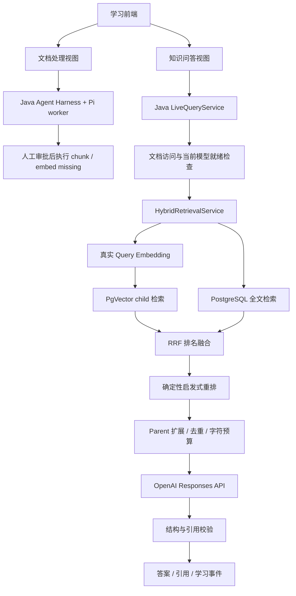

# NexusAgent 真实 RAG 问答与学习前端设计

日期：2026-09-14

状态：2026-09-14 用户已批准继续第三步，并确认默认全库/可选指定文档两种范围；第三步已实现待 review。见 [第三步 review](../../review/rag-phase-3.md)。付费模型验收独立进行，未在此次自动执行。

交付方式：中文 review，小步实现；不自动提交 Git，不自动修改现有文档或向量。

## 1. 本次做什么

保留现有 Pi 文档处理工作台，新增“知识问答”视图。用户选择已经准备好的文档、输入问题，Java 执行已有 RAG 链路，再调用真实模型生成带引用的答案。学习页面展示这一次实际执行的阶段、状态、有限输入输出和源码入口。

两条路径明确分开：

- **文档处理**：Pi 判断处理状态、读取任务历史、提出处理建议；Java 管理人工审批并执行写操作。
- **知识问答**：Java 固定编排检索、上下文与模型回答。无需 Pi worker，不创建文档处理 run，不自动 chunk、embed 或批准操作。

“管理员后台 / 客户端”只是功能分区，不代表已经具备管理员角色、正式登录或 RBAC。

## 2. 方案选择与代码现状

| 方案 | 取舍 | 决定 |
| --- | --- | --- |
| Java 固定 RAG + 真实回答模型 | 复用现有接口和权限过滤，执行顺序易观察、易测试 | 本次采用 |
| Pi 自主选择检索工具再回答 | 需要新的工具权限、调用循环和回答校验，调度更复杂 | 后续再评估 |
| 只给旧模板接口加聊天外观 | 开发量小，但仍不是实际模型问答 | 不采用 |

已核对的关键事实：

1. 现有 `/api/v1/query` 和 `/api/v1/query/stream` 已调用 `ContextBuilder`，但回答来自 `LocalTemplateAnswerGenerator`；Pi 接入没有改变这条链路。
2. 默认 `LocalDeterministicEmbeddingProvider` 产生 384 维本地向量。当前 embedding 状态按行数计数，向量 SQL 未按 provider/model 过滤，不能直接切换真实模型后混用。
3. `child_chunk_embeddings` 是每个 child 一行，已有 provider、model_name、dimension 和 `vector(384)`；无需为了本次接入先扩建向量数据库。
4. 现有查询 SSE 在真正调用 `ContextBuilder` 前就发出了 reranking/building_context 通知，不能当作真实阶段追踪。
5. Redis context cache 的 key 已含 tenant/actor，但缺少 embedding 模型标识和文档版本；不能直接用于这次模型切换后的问答。
6. 当前 Spring AI embedding 是自定义适配边界，没有实际 Spring AI SDK 客户端依赖。

## 3. 架构与职责

新增 `OpenAiEmbeddingProvider` 实现现有 `EmbeddingProvider`，新增 `OpenAiAnswerGenerator` 实现现有 `AnswerGenerator`。使用 Spring WebClient 的非阻塞 HTTP，不为这一步升级 Spring Boot 或引入一整套 Agent 框架。

两种适配器共享有限的 HTTP 配置、错误映射和凭证装配，业务规则仍归各自模块。保留现有 Spring AI 边界，但不能将本次 HTTP 适配器描述成已使用 Spring AI SDK。

保留本地实现供离线测试或明确选择的 demo profile 使用。真实模式配置错误必须明确失败，不能悄悄回退到 hash embedding 或模板回答。

## 4. 真实模型与配置

- 回答模型沿用用户已选的 `gpt-5.6-luna`，调用 Responses API；首版使用有界输出与结构化 JSON。
- Embedding 单独使用 `text-embedding-3-small`，显式请求 `dimensions=384`，与当前表维度一致。384 是减少迁移范围的工程选择，不是经本项目评测得出的最优维度。
- 问题和 child 文本必须使用相同的 provider、model、dimension。维度相同但模型不同，仍然属于不同向量空间。
- 沿用服务端 `NEXUS_LLM_API_KEY`、`NEXUS_LLM_MODEL`；增加独立的 `NEXUS_ANSWER_PROVIDER` 和 `NEXUS_EMBEDDINGS_MODEL`，复用 `NEXUS_EMBEDDINGS_PROVIDER`、`NEXUS_EMBEDDINGS_DIMENSION`。模型 key 不传给浏览器。
- 增加问答能力只读接口 `GET /api/v1/query/capabilities`，只返回回答 provider/model、embedding provider/model/dimension、缓存模式、问题长度和文档数量上限；不返回 key、内部地址或原始配置。
- 真实学习模式要求回答与 embedding 均为真实 provider。能力不满足时显示明确原因，不展示“真实 RAG 已就绪”。
- 默认真实回答总超时 90 秒，单次 embedding 请求 20 秒，上下文阶段总超时 45 秒，均可配置；禁止无限重试。

OpenAI 支持 embedding 维度参数、Responses API 结构化输出；适配器仍需处理拒答、输出不完整、限流和无权限模型等实际响应，不能只解析成功案例。参考[Embedding 文档](https://developers.openai.com/api/docs/guides/embeddings)、[模型说明](https://developers.openai.com/api/docs/models/gpt-5.6-luna)和[结构化输出文档](https://developers.openai.com/api/docs/guides/structured-outputs)。

## 5. 现有文档和向量如何处理

### 状态与普通 embedding

`GET /api/v1/documents/{id}/embedding-status` 增加当前模型匹配计数、不匹配计数和就绪状态。`complete` 表示所有当前 child 都有匹配当前模型的向量，而不是数据库中恰好有同样多的向量行。

普通 `POST /api/v1/documents/{id}/embed` 继续只补缺失向量，不覆盖已有其他模型向量；发现不匹配时返回清晰的 409 `EMBEDDING_MODEL_MISMATCH`。Pi 的 `EMBED_MISSING` 不获得替换其他模型向量的权限。

向量查询必须在 SQL 中按 provider/model/dimension 过滤，再排序与 LIMIT，不能取完 topK 后才过滤。

### 明确确认的向量重建

扩展现有接口：`POST /api/v1/documents/{id}/embed?replaceExisting=true`。入口放在文档准备区域，需要用户确认“将为此文档替换向量并产生外部 API 用量”。这不是 Pi 自动批准，也不进入普通聊天的工具集合。

重建只替换 embedding，不重新 chunk，因此 parent/child ID、chunk_index、文本和 char offsets 保持不变。一次最多处理 256 个 child，总待嵌入文本最多 1,000,000 个 Java 字符；超过限制明确拒绝，后续再设计批任务，不无界占用内存。

顺序如下：

1. 按 tenant/actor 验证文档访问，记录当前 child ID 和文本指纹，创建 `REEMBED` ingestion job。
2. 在数据库事务外生成有界的新向量，逐项校验维度、数值有限性和非零范数。失败不修改原向量。
3. 打开短 R2DBC 事务，锁定文档行，复查访问及 child 快照仍一致，再整体 upsert 新向量；任一步失败全部回滚。
4. chunk 替换和 embedding 写入遵循同一文档行锁约定；普通补向量在提交时复查目标 child 和已有模型，不能覆盖刚提交的新模型。
5. chunk 已改变则以 409 `DOCUMENT_CHANGED` 结束，不自动付费重跑。成功后完成 job 与安全审计。

现有表和 `REEMBED` job 类型足够表达该流程，预计无需新 migration；不编辑历史 migration。HTTP 调用期间不持有数据库锁。取消请求不保证撤销已被外部服务接收的请求，也不承诺退回其用量。

## 6. 问答 API、证据与错误语义

复用 `POST /api/v1/query` 和 `POST /api/v1/query/stream`。请求使用 sessionId、question、scope、documentIds、topK、contextBudgetChars、debug。

第三步按用户补充批准改为两种范围：默认 `library` 自动选取当前身份可访问且当前 embedding 模型完全就绪的文档，返回排除原因计数；可选 `documents` 明确选中 1–10 份且全部就绪。question 为 1–2,000 字符。全库学习上限是 200 份可访问文档，超过明确 400 而不是静默截断，零就绪明确 409，均不调用模型。两条检索路径使用同一非空就绪 ID 快照。指定模式跨租户/不可访问返回 404，未就绪返回 409；不暗中处理文档。旧请求带 IDs 推断为 documents，无 IDs 推断 library。旧离线示例不删除。

响应保持 answer、citations、traceId；增加安全的 answerStatus 与 generator/provider/model，区分真实生成、证据不足和拒答。debug=true 才包含 finalContextText、检索/上下文详情和学习阶段数据。

### 模型输入与答案校验

- 输入是用户问题和当前经过权限过滤、预算裁剪的 parent 文本，不是向量数组、全部文档或所有 top-30 child。
- 文档属于不可信参考资料，不能覆盖系统指令；回答模型没有 shell、文档写入或 Pi 工具。
- 结构化输出包含 `status`、`answer`、`usedCitationMarkers`。Java 解析 Responses 的 message/output_text 类型，不假设 output[0] 就是答案。
- `answered` 要求非空答案和至少一个有效引用。正文引用集合与 usedCitationMarkers 一致，并且必须是本次 ContextBuilder 生成的引用集合的子集。
- 最终公开 citations 仅返回模型实际引用的条目；debug 中仍可查看所有检索证据。UUID、文件名和 offsets 从后端证据映射取得，不允许模型编造。
- 空上下文直接返回 `insufficient_context`，不花费模型调用；模型判断证据不足时同样返回明确说明且 citations 为空。拒答使用独立状态，不伪装成正常回答。
- 无效 JSON、未知引用、缺少引用、截断响应视为生成失败，不把未经校验的回答展示给用户，不自动再调一次模型“修复”。

引用校验只能验证出处关联和结构一致，不能证明每句话真实被证据支持。本次不宣称完成事实性评测或 LLM-as-judge。

`contextBudgetChars` 保留当前“parent 正文字符预算”的语义，不改称模型 token 预算。格式化引用标题存在额外开销；另对完整外发问题与上下文设置 64 KiB UTF-8 上限，超限明确拒绝，不暗中截断引用。

### 失败与重试

本地输入错误返回 400，未准备完成返回 409，外部配置/服务故障返回安全的 502/503，超时返回 504；错误包含 traceId 和稳定 code，不包含原始 provider body、key 或堆栈。

仅 embedding 客户端对明确的 429/短暂 5xx 最多重试一次，使用有界退避且受阶段总超时限制。回答调用默认不自动重试，避免重复收费；删除真实模式在整个 context 链路外统一重试的行为。网络结果不确定时提示用户，不保证请求未产生用量。

SSE 建流前完成输入和就绪检查，因此这些错误仍是正常 HTTP 错误；预检查的阶段记录在请求内暂存，建流后按原始时间发送，不重复检查来制造事件。建流后的失败发送一个 error 终止事件，不再发送 completed。真实模式不把超时伪装成本地成功答案，也不悄悄降级成全文检索成功。

## 7. 学习事件是真实执行记录

向现有编排链路传入请求级、默认 no-op 的阶段观察器，在实际订阅、完成和失败边界记录事件。REST 与 SSE 调用同一执行流水线，不能为了画图重复执行检索或模型调用。

阶段：`access_check`、`embedding_readiness`、`cache_lookup`、`query_embedding`、`vector_search`、`full_text_search`、`rrf_fusion`、`reranking`、`parent_expansion`、`context_building`、`answer_generation`、`citation_validation`。

SSE envelope 含 traceId；stage 内含 sequence、stage、attempt、status、timestamp、durationMs 和有界 summary；status 为 running/succeeded/skipped/failed/cancelled。当前每个业务阶段只执行一次，attempt=1，不把 embedding HTTP 客户端内部重试伪装成整个阶段重试。并行检索的完成顺序不固定，前端根据依赖关系绘图，不强制画成假串行。

- 保留现有 received/message/completed/error 契约；阶段事件提供真实开始与结束。debug=false 只含安全阶段状态，不含输入输出证据。
- debug=true 的实时 summary 只发计数、模型标识和状态，不提前发原文/文件名；完成时经权限复查的 retrievalDebug/contextDebug 提供候选排名/分数、预览和裁剪详情，前端可据此填充已完成阶段。单阶段 summary 最多 16 KiB，超限省略并标记。
- 源码文件和函数说明是静态学习映射，单独标识；它不是运行时完整调用栈，也不是模型的隐藏思维过程。
- 首版 SSE 实时传递真实进度，答案通过校验后一次发送 message。**不实现逐 token 输出，不拆分完整答案制造假 token 流。**
- 使用 fetch 和现有 SSE parser。断线时显示结果未确认，不自动重新 POST 产生第二次模型调用；当前查询事件不做持久化恢复。
- 中止请求会取消本地 reactive 订阅并停止更新 UI，不宣称远端模型立刻取消或未收费。

## 8. 缓存、访问与敏感数据

首个真实问答版本始终绕过 retrieval/context cache 的读取和写入，返回 `retrievalCacheStatus=bypassed`；这是避免旧向量/旧证据污染的明确取舍，不是“Redis 已失效”。保留原离线缓存测试与实现，session/status/有界 tool output 仍可使用 Redis。

本次为原缓存 key 增加 embedding provider/model/dimension 及 cache schema 版本，消除模型空间碰撞；但在文档版本失效与命中后权限复查完成前，不在真实问答模式启用 context cache。超时或失败生成的空 context 不写缓存。不会通过清空整个 Redis 来迁移。

请求身份继续来自 X-Tenant-Id / X-Actor-Id；PRIVATE 继续按 owner 过滤。进入检索、扩展 parent、外发证据前和返回答案前检查访问，不把浏览器文档列表当作授权结果。身份切换中止旧请求并丢弃旧响应，清空聊天及详情内存。

这些措施不是生产认证，也不能承诺在没有验证身份及完整授权体系时实现生产隔离。并发变更仍需要未来更完整的授权和版本策略。

真实 embedding 会把选中的 child 文本发送给 OpenAI；真实回答会发送问题及选中的 context。这是外部数据传输，准备文档和首次问答时需明确告知，联调只使用合成公开测试资料。

Responses 请求设置 `store:false`，但不能将它描述为零数据保留保证，仍受服务提供方数据政策约束。见[OpenAI 数据控制说明](https://developers.openai.com/api/docs/guides/your-data)。

日志和审计只保存 traceId、模型标识、计数、耗时、状态和有限 hash；不保存原始问题、完整 prompt、文档文本、API key 或 provider 原始响应。前端不存持久聊天内容、不使用 dangerouslySetInnerHTML 渲染模型输出。

## 9. 前端交互

沿用现有 React/TypeScript 三栏，不重做 landing page。顶部切换“知识问答 / 文档处理”，共享本地演示身份；两者的运行状态、请求和页面缓存独立。

- 左栏：文档选择、当前模型就绪状态、问题输入、答案和可点击引用。未就绪给出文档准备入口，不自动处理。
- 中栏：实际执行的 DAG，展示并行分支、阶段耗时及成功/失败/跳过。尚未开始保持待执行；出错不把下游节点点亮。
- 右栏：选中阶段的真实有限输入输出、候选分数或上下文预览，以及独立的源码职责说明。
- 点击引用定位对应 parent 片段并显示命中 child、文件名和全局 offsets；裁剪后仅高亮实际保留的范围，不伪造完整原文。
- 沿用桌面三栏、小屏标签切换；发送、停止、展开和查看详情使用现有图标与 tooltip 约定。

首版每个问题独立回答，页面可展示本次访问期间的问答记录，但不会把历史聊天自动作为下一问的模型输入。sessionId 是生命周期关联，不等于已实现多轮语义记忆。

前端从 capabilities 和响应读实际模型状态，不让用户在浏览器输入 API key，不通过页面启动 worker，不改现有本地代理安全边界。

## 10. 实现顺序与验收

### 第一步：真实 provider 与文档准备

实现两种 provider、能力接口、模型匹配查询/状态、明确确认的原子向量替换。测试模型不匹配、维度与响应校验、未授权拒绝、失败保持原向量、chunk 并发变化、ID/offset 不变和 REEMBED job。完成后提供中文 review，再推进问答链路。

### 第二步：问答编排与真实事件

接通已有 Query API，补就绪检查、引用校验、真实阶段观察、安全失败和缓存 bypass。测试空证据不调模型、有效/无效引用、限流/超时、debug 隐藏、同一 traceId、并行阶段先后约束、SSE 单次执行、跨 tenant/PRIVATE 过滤和取消传播。

### 第三步：问答学习视图与联调

实现问答视图、引用详情和事件图；测试身份切换、旧响应丢弃、未就绪、失败、断流不重发和桌面/移动布局。保留现有 Pi 文档处理页面行为与审批测试。

自动测试使用模拟 HTTP provider，不依赖真实 key；PostgreSQL/PgVector 用 Testcontainers 验证真实 SQL 过滤和事务。浏览器测试区分 mocked 接口与真实本地集成，不能把测试 fixture 描述成 live model。

付费验收单独显式开启：使用合成文档完成一次真实 embedding 和少量问题验证，包含有证据的问题、没有答案的问题和非法访问检查。只断言引用/权限/状态等稳定条件，不把自然语言逐字匹配或一次成功当作质量评测。

同步更新 README、API、学习工作台说明、limitations、interview-defense，并增加中文学习笔记和 review。记录实际运行的后端测试、worker 回归、前端测试/构建及浏览器验证；在实际实现前不声称测试通过或功能已完成。

## 11. Definition of Done 与保留限制

验收通过须同时满足：

1. 浏览器可以用真实 embedding 准备合成文档，并通过真实 LLM 得到可追溯的答案。
2. 旧模型向量不能被误判为就绪、不能参与新模型距离比较；明确重建失败不破坏旧向量。
3. 普通知识问答没有文档写副作用，不依赖 Pi worker，也不绕过 Pi 审批。
4. 页面阶段由真实事件驱动，引用来自实际上下文，错误没有模板成功伪装。
5. 未授权数据不会进入检索结果、外发 prompt 或前端 debug；密钥保持服务端配置。
6. 自动测试无需付费 key，独立记录真实调用验收；中文 review、学习笔记、运行命令与限制齐全。

仍然是学习项目：启发式 reranker 不是 cross-encoder；全文检索仍使用现有 English 配置；字符预算不是 tokenizer 预算；没有多轮记忆、检索质量基准、生产鉴权、模型事实性保证或持久化查询恢复。真实问答模式暂不复用 context cache，不声称生产吞吐或时延。

本次不增加 Pi 检索工具、自主多 agent、模型训练、正式登录、RBAC、GPU serving 或部署平台。之后是否做 Agentic RAG，应在固定真实问答完成并有可比较基线后另行设计。
